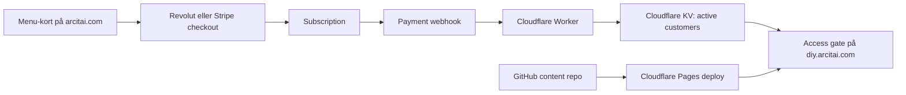
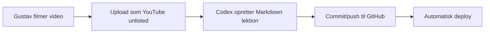

# Do It Yourself: lightweight access, betaling og content

Dato: 2026-06-16

## Kort konklusion

Den rigtige retning er et separat repo, fx `do-it-yourself`, med et statisk, dokumentagtigt course/library-site på `diy.arcitai.com`. Content bør ligge som Markdown/MDX i repoet, billeder som filer i repoet eller et simpelt asset-bucket, og video som YouTube unlisted embeds i første version.

GitHub Pages kan godt bruges til et subdomain, men GitHub Pages er grundlæggende statisk hosting. Det kan ikke selv håndtere betalt kundelogin, subscription-status, konti eller adgangsrevokering. GitHub har privat Pages-adgang i Enterprise Cloud, men det er målrettet repo-/enterprise-medlemmer, ikke betalende kunder. Derfor er GitHub Pages bedst til public marketing eller helt åben dokumentation, ikke som selve betalingsmuren.

Den mest lightweight robuste version er:

1. Revolut Subscriptions eller Stripe Payment Links/Checkout til monthly/annual abonnement.
2. Providerens selvbetjening til kortskift/opsigelse, hvor Stripe Customer Portal er den mest modne standardløsning.
3. Et lille Cloudflare Worker/Pages Functions access-lag, der modtager Revolut/Stripe webhooks og gemmer aktive emails i Cloudflare KV.
4. Enten Cloudflare Access OTP, hvor Worker synker aktive emails ind i en Access-policy via API, eller en minimal Worker-baseret magic-link/session-løsning foran `diy.arcitai.com`.
5. Content deployes automatisk fra GitHub, så Codex kan tilføje lektioner ved at ændre Markdown og pushe.

Hvis målet er absolut færrest komponenter, så brug Cloudflare Pages i stedet for GitHub Pages til selve DIY-sitet. Det er stadig GitHub-drevet og statisk, men det gør auth/webhooks/subdomain-proxy meget enklere.

## Subdomain og GitHub Pages

GitHub Pages understøtter custom subdomains. For et subdomain som `diy.arcitai.com` skal repoet have custom domain sat i GitHub Pages, og DNS skal have en `CNAME`, der peger subdomainet mod GitHub Pages default-domainet, fx `<organization>.github.io`. GitHub anbefaler også at verificere custom domainet først for at undgå subdomain takeover-risiko.

Praktisk opsætning med GitHub Pages:

```txt
diy.arcitai.com CNAME <organization>.github.io
```

eller hvad organisationens GitHub Pages default-domain konkret er.

Begrænsningen: hvis repoet/site-indholdet er public, er indholdet reelt public. Man kan lægge Cloudflare Access foran custom domainet, men man skal sikre, at der ikke findes en bypass via `github.io`-URL eller offentlige filer. Derfor er GitHub Pages ikke mit førstevalg til betalt content.

Bedre opsætning:

```txt
GitHub repo -> Cloudflare Pages -> diy.arcitai.com
Cloudflare Access/Worker -> auth og subscription gate
Stripe/Revolut -> betaling og subscription events
```

## Betaling: Stripe vs. Revolut

### Stripe

Stripe er den mest modne løsning til den her type produkt, især fordi Payment Links, Checkout, Billing, webhooks og Customer Portal hænger godt sammen.

Relevante aktuelle Stripe-priser for Danmark:

- Standard EEA-kort: `1.5% + 1.80kr`
- Premium EEA-kort: `1.9% + 1.80kr`
- UK-kort: `2.5% + 1.80kr`
- Internationale kort: `3.25% + 1.80kr`
- Currency conversion: typisk ekstra `+2%`, hvis nødvendig
- Stripe Billing pay-as-you-go: `0.7%` af Billing volume oveni betalingsprocessing for subscriptions
- Disputes: `200kr` pr. dispute

Fordele:

- Payment Links kan sælge subscription uden at bygge checkout.
- Checkout er nemt, hvis vi senere vil have mere kontrol.
- Customer Portal kan håndtere kortopdatering, invoices, planændring og cancellation uden at bygge det selv.
- Webhooks er standardvejen til at provisionere og fjerne adgang ved `customer.subscription.created`, `customer.subscription.updated`, `customer.subscription.deleted`, `invoice.paid`, `invoice.payment_failed`.

Ulemper:

- Billing-fee oveni card-fee.
- Stripe er ikke “auth”; vi skal stadig have et lille access-lag.

### Revolut Business

Revolut er interessant, fordi du allerede har erhvervskonto der, og de har både Merchant API og Subscriptions API.

Relevante aktuelle Revolut-priser for Danmark:

- Online domestic Visa/Mastercard consumer cards: `1% + kr. 1.70`
- Online domestic commercial cards: `2.8% + kr. 1.70`
- Online international cards: `2.8% + kr. 1.70`
- Online American Express domestic consumer: `1.7% + kr. 1.70`

Fordele:

- Lavere pris end Stripe på almindelige danske/EEA consumer cards.
- Pengene lander samme sted som erhvervskontoen.
- Revolut har Subscriptions API med planer, variationer, hosted onboarding og automatisk charging.

Ulemper:

- Mindre standardiseret økosystem end Stripe for subscription SaaS-ish flows.
- Mindre plug-and-play omkring Customer Portal, webhook recipes, community-eksempler og tredjepartsintegrationer.
- Hvis produktet senere skal sælges som template til andre, er Stripe mere genkendeligt og lettere at dokumentere.

Anbefaling: start med Revolut for Arcit AI selv, hvis lavere danske card fees og din eksisterende erhvervskonto vægter højest. Start med Stripe, hvis template-værdi, Customer Portal og bredest mulig kopierbarhed vægter højest.

## Auth og adgang

Der er tre realistiske niveauer.

### Niveau 0: billigst, men svagt

Revolut/Stripe sender kunden til en success-side med et delt password til et statisk krypteret site.

Det er teknisk simpelt, men ikke professionelt nok:

- Password kan deles.
- Adgang fjernes ikke automatisk ved opsigelse.
- Ingen individuel kundeidentitet.
- Dårlig template-værdi.

Brug kun dette til en ultra-tidlig test med få kunder.

### Niveau 1: anbefalet MVP

Brug kundens betalings-email som login-identitet.

Flow:

1. Kunden klikker “Monthly” eller “Annual” fra menu-kortet.
2. Revolut/Stripe opretter subscription.
3. Revolut/Stripe webhook rammer en Cloudflare Worker.
4. Worker verificerer webhook-signaturen og skriver email + subscription status i Cloudflare KV.
5. Kunden går til `diy.arcitai.com`.
6. Cloudflare Access sender one-time PIN til kundens email, hvis aktive emails synkes ind i Access via API. Alternativt sender Worker-login selv et magic link.
7. Kun emails med aktiv subscription får adgang.
8. Ved cancellation/payment failure opdaterer webhook KV og adgang fjernes.

Det her er stadig lightweight:

- Ingen database-server.
- Ingen traditionel backend.
- Ingen bruger-dashboard i første version.
- Ingen community-app.
- Ingen tung course-platform.

### Niveau 2: mere produktagtigt

Brug Supabase Auth, Clerk eller Auth.js plus Revolut/Stripe. Det giver pænere konti og sessioner, men det er mere app end nødvendigt. Jeg ville vente med det, indtil DIY-benet har bevist salg.

## Video

YouTube “private” er ikke en god løsning til et betalt site. Private YouTube-videoer kan kun ses af de specifikt inviterede Google-konti. YouTube siger også, at unlisted videoer kan ses og deles af alle med linket.

Anbefaling for MVP:

- Brug YouTube unlisted.
- Embed kun inde på det gatede site.
- Accepter, at linket kan deles.
- Hold high-value delen i kombinationen af løbende opdateringer, templates, Codex-workflows og adgang til dig, ikke i “DRM”.

Hvis video senere skal være reelt sværere at dele:

- Vimeo paid/private embed restrictions
- Bunny Stream
- Mux
- Cloudflare Stream

Det øger omkostninger og drift, så det er ikke MVP.

## Content-model

Repo-struktur for `do-it-yourself`:

```txt
content/
  00-start-her.md
  01-positionering.md
  02-menu-kort.md
  03-ai-native-ops.md
  04-newsletter-template.md
  05-course-template.md
assets/
  images/
  downloads/
src/
  ...
```

Hver lektion kan have frontmatter:

```yaml
---
title: "Start her"
description: "Overblik og første setup"
youtube_id: "abc123"
tags: ["setup", "positionering"]
status: "published"
updated: "2026-06-16"
---
```

Det gør det nemt for Codex at tilføje en ny lektion:

1. Opret en ny Markdown-fil.
2. Tilføj YouTube ID og tekst.
3. Tilføj billede eller download.
4. Kør build.
5. Push til GitHub.
6. Cloudflare Pages deployer automatisk.

## Automatiseringsflow

MVP-flow uden n8n:



Ved nyt content:



## Estimeret månedlig teknisk pris

Ved lav volumen:

- GitHub repo: `0kr`
- Cloudflare Pages static hosting: `0kr`
- Cloudflare Access: `0kr` op til 50 brugere ifølge Cloudflare Zero Trust pricing, men derefter `7 USD/user/month`; derfor er Access fint til beta, men ikke ideelt som permanent kunde-auth, hvis der kommer mange subscribers
- Cloudflare Workers Free: `100,000` requests/day; Paid starter ved minimum `$5/mo`, hvis man vil have højere limits/roligere drift
- Cloudflare KV Free: `100,000` reads/day, `1,000` writes/day, `1GB` storage
- Stripe: ingen setup/månedligt platform fee, men card fee + Billing fee
- YouTube unlisted: `0kr`

Realistisk MVP-infrastruktur: `0-5 USD/md` plus betalingsfees.

## Pricing-sammenligning

Den vigtige afklaring er, at selve content-delen næsten ikke koster noget. Markdown, billeder, statiske HTML-sider og YouTube embeds er billige eller gratis ved lav volumen. Det, der koster, er:

1. betalingsgebyrer på hvert abonnement
2. eventuel auth/email, hvis vi ikke bruger Cloudflare Access
3. eventuel Cloudflare Workers Paid, hvis traffic eller auth-requests vokser ud af free tier

### Hvad ligger hvor?

| Komponent                         | Hvad gemmes der?                                               | Nødvendigt?                       | Gratisniveau                                             | Kommentar                                                                                                                                        |
| --------------------------------- | -------------------------------------------------------------- | --------------------------------- | -------------------------------------------------------- | ------------------------------------------------------------------------------------------------------------------------------------------------ |
| GitHub repo                       | Markdown, kode, billeder, downloads, templates                 | Ja                                | Gratis for public/private repos afhængigt af GitHub-plan | Godt som source of truth. Hvis repoet er public, er content også offentligt læsbart i repoet.                                                    |
| GitHub Pages                      | Public statisk site                                            | Kun hvis sitet er åbent/public    | Gratis med soft limits                                   | Ikke godt som betalingsmur. GitHub siger selv, at Pages ikke er tænkt som gratis hosting til e-commerce/SaaS og ikke til sensitive transactions. |
| Cloudflare Pages                  | Statisk hosting fra GitHub                                     | Anbefalet til gated DIY-site      | Static asset requests er gratis og unlimited             | Bedre end GitHub Pages her, fordi Pages Functions/Worker kan gate adgangen samme sted.                                                           |
| Cloudflare Worker/Pages Functions | Webhooks, auth-check, session-cookie, gated routes             | Ja, hvis der er subscription-gate | 100,000 requests/day på free plan                        | Hvis middleware kører på alle assets, tæller mange requests. Gate primært HTML/private downloads, og lad public CSS/JS være åbent.               |
| Cloudflare KV                     | Email -> subscription status, customer id, plan, expiry        | Ja, men meget lille               | 100,000 reads/day, 1,000 writes/day, 1GB storage         | KV-data bliver tiny: fx 1,000 kunder er stadig kun få MB. KV er ikke en stor cost driver.                                                        |
| Cloudflare Access                 | Email OTP/login                                                | Kun beta eller intern adgang      | Free op til 50 users                                     | Bliver dyrt som kundelogin ved skalering: `7 USD/user/month` over free tier. Brug ikke dette som langsigtet auth for mange betalende kunder.     |
| Resend eller lignende             | Magic-link/welcome emails                                      | Kun hvis vi laver egen login      | Resend free: 3,000 emails/month, 100/day                 | Egen Worker-auth + Resend er billigere end Cloudflare Access, hvis der kommer >50 kunder.                                                        |
| YouTube embeds                    | Videoafspilning                                                | Ja i MVP                          | Gratis                                                   | Brug iframe/embed. YouTube Data API er kun nødvendig, hvis vi automatisk henter metadata/playlists; embeds kræver ikke Data API.                 |
| YouTube Data API                  | Video metadata, playlists, kanaldata                           | Nej i simpel MVP                  | 10,000 quota units/day                                   | Brug frontmatter `youtube_id` i Markdown i stedet for API, medmindre der er reel automationsværdi.                                               |
| Stripe                            | Monthly/annual subscription, checkout, portal, webhooks        | Payment-option                    | Ingen fast platform fee for standard setup               | Card fee + Stripe Billing fee. Bedst template-værdi og nemmest onboarding.                                                                       |
| Revolut Business                  | Monthly/annual subscription, hosted payment page, webhooks/API | Payment-option                    | Included with Revolut Business plans                     | Billigere på danske consumer cards, men mindre udbredt som template-standard.                                                                    |

### Scenarier

| Scenarie                                | Hosting                     | Auth                                | Payment                                    | Fast månedlig tech cost                                 | Variable cost                              | Vurdering                                                                              |
| --------------------------------------- | --------------------------- | ----------------------------------- | ------------------------------------------ | ------------------------------------------------------- | ------------------------------------------ | -------------------------------------------------------------------------------------- |
| A. Ultra-light public                   | GitHub Pages                | Ingen                               | Stripe/Revolut link fra public side        | `0kr`                                                   | Payment fees                               | Billigst, men ingen gated DIY. Kun egnet til åbent content.                            |
| B. GitHub Pages + delt password         | GitHub Pages                | Delt password/krypteret static site | Stripe/Revolut                             | `0kr`                                                   | Payment fees                               | Kan fungere til test, men adgang kan deles og fjernes ikke automatisk.                 |
| C. GitHub Pages + Cloudflare foran      | GitHub Pages bag Cloudflare | Cloudflare Access/Worker            | Stripe/Revolut                             | `0kr` til lille beta                                    | Payment fees + evt. Access users           | Teknisk muligt, men origin-bypass via `github.io` og public repo/content er svagheden. |
| D. Cloudflare Pages + Cloudflare Access | Cloudflare Pages            | Cloudflare Access OTP               | Stripe/Revolut webhook -> Access allowlist | `0kr` op til 50 users                                   | Payment fees; efter 50: `7 USD/user/month` | God beta-model, men ikke billig som egentlig kundesystem ved vækst.                    |
| E. Cloudflare Pages + Worker magic-link | Cloudflare Pages            | Worker session + KV + Resend        | Stripe/Revolut webhooks -> KV              | `0kr` ved lav volumen; evt. `$5/mo` Workers Paid senere | Payment fees + evt. email over free tier   | Bedste lightweight produktmodel. Ingen full-stack app, ingen dyr per-user auth.        |
| F. Full app                             | Vercel/Cloudflare + DB      | Clerk/Supabase/Auth.js              | Stripe/Revolut                             | Typisk `0-25+ USD/mo` før payment fees                  | Payment fees + auth/db/mail                | Mere fleksibelt, men for tungt til første version.                                     |

### Betalingsgebyrer ved eksempelpris

Eksempel med en monthly pris på `499kr` og en annual pris på `4,990kr`. Regnestykket er vejledende og afhænger af korttype, kundens land, valuta og chargebacks.

| Payment setup                         | Monthly `499kr` | Annual `4,990kr` | Kommentar                                                                        |
| ------------------------------------- | --------------- | ---------------- | -------------------------------------------------------------------------------- |
| Stripe standard EEA card + Billing    | ca. `12.78kr`   | ca. `111.58kr`   | `1.5% + 1.80kr` for kort + `0.7%` Billing.                                       |
| Revolut domestic consumer card        | ca. `6.69kr`    | ca. `51.60kr`    | `1% + 1.70kr`. Billigst hvis kunderne primært betaler med danske consumer cards. |
| Revolut international/commercial card | ca. `15.67kr`   | ca. `141.42kr`   | `2.8% + 1.70kr`. Dyrere end Stripe standard EEA i mange EU-scenarier.            |

Konklusion på payment: Hvis det primært er danske kunder, kan Revolut være billigere. Hvis det skal være en generisk skabelon, som andre nemt kan kopiere, bør payment-laget være adapter-baseret: `paymentProvider = "stripe" | "revolut"`. Stripe bør være default i templaten, Revolut bør være en understøttet variant.

### Hvorfor ikke bare Revolut?

Man kan godt bruge Revolut. For din egen forretning kan det faktisk være den bedste første payment-provider, fordi du allerede har Revolut Business, og domestic consumer card fees ser lavere ud end Stripe.

Grunden til at Stripe stadig er default-anbefalingen for en template er ikke pris, men produktmodenhed:

- Stripe Payment Links og Checkout er ekstremt standard for subscriptions.
- Stripe Customer Portal løser selvbetjening: kortskift, invoices, cancellation og planændringer.
- Stripe webhooks er velkendte og nemme at kopiere i tutorials.
- Næsten alle no-code/low-code/AI-coding examples forventer Stripe først.

Revolut Subscription API er dog reel: den understøtter subscription plans, variations, hosted onboarding, automatisk charging, payment history og cancellation. Den tekniske forskel er, at Revolut-flowet typisk kræver, at vi først opretter eller finder en customer, opretter subscription på backend, henter checkout URL og håndterer Revolut webhooks/order/subscription-state. Det er stadig lightweight, men mindre "copy-paste standard" end Stripe.

Min præcise anbefaling:

- Til `arcitai.com` selv: Revolut-first er helt fair, hvis du vil holde penge og fees tæt på din erhvervskonto.
- Til en salgsbar template: lav en payment-adapter, hvor Stripe er default og Revolut er option.
- Uanset provider skal adgangslaget kun kende én ting: `email + active/inactive + plan + periodEnd`.

### Kan det bare leve på GitHub Pages?

Ja, hvis content er public.

Nej, ikke rent nok, hvis det skal være gated monthly/annual content. Der er tre problemer:

1. GitHub Pages kan ikke selv validere abonnementer eller logins.
2. Hvis repoet er public, kan Markdown/billeder læses direkte på GitHub.
3. Hvis Pages-sitet er offentligt på `github.io`, kan Cloudflare foran custom domainet blive bypasset, medmindre origin og public URLs er håndteret meget stramt.

Derfor er den simpleste robuste model ikke "GitHub Pages + lidt auth", men "GitHub repo + Cloudflare Pages + Worker/KV". Det føles næsten lige så simpelt i drift, fordi GitHub stadig er source of truth, men adgangslaget ligger et sted, hvor det faktisk kan håndhæves.

### Hvor meget KV bruges?

Næsten ingenting.

En KV-record kan fx være:

```json
{
  "email": "kunde@example.com",
  "provider": "stripe",
  "customerId": "cus_...",
  "subscriptionId": "sub_...",
  "status": "active",
  "plan": "monthly",
  "currentPeriodEnd": "2026-07-16"
}
```

Selv hvis hver kunde fylder `1KB`, fylder:

- 100 kunder ca. `100KB`
- 1,000 kunder ca. `1MB`
- 10,000 kunder ca. `10MB`

Det er langt under Cloudflare KV free storage på `1GB`. Reads er også lave, hvis vi bruger session-cookie og kun tjekker KV ved login/session refresh. Writes sker primært ved webhook-events, ikke ved hvert pageview.

### Endelig cost-konklusion

Min opdaterede anbefaling:

1. Brug ikke GitHub Pages som gated product-host.
2. Brug GitHub som repo/source of truth.
3. Brug Cloudflare Pages til hosting, fordi static assets er gratis og Workers/Functions kan håndhæve adgang.
4. Brug egen Worker magic-link auth + KV, ikke Cloudflare Access som permanent kundelogin.
5. Gør payment-laget provider-agnostisk, men start med Stripe eller Revolut ud fra første kundegruppe:
   - Stripe først, hvis template-værdi og nem kopiering er vigtigst.
   - Revolut først, hvis egne danske kunder og lavest card fee er vigtigst.

For en lille MVP er realistisk fast tech cost stadig `0kr/md` plus betalingsgebyrer. Det første sandsynlige faste beløb bliver enten `$5/md` for Workers Paid, hvis man vil have mere ro end free tier, eller en email-provider, hvis login-mails vokser ud af gratisniveauet.

## Min anbefalede beslutning

Byg ikke dette som en full-stack course app.

Byg det som:

1. Nyt repo: `do-it-yourself`
2. Hosting: Cloudflare Pages fra GitHub
3. Domain: `diy.arcitai.com`
4. Payment: Revolut-first for Arcit AI selv, men med payment-adapter så Stripe også kan bruges
5. Access: Cloudflare Worker + KV + email-based OTP/magic-link
6. Video: YouTube unlisted embeds
7. Content: Markdown i repoet
8. Drift: Codex-opdateringer via GitHub commits

Det holder teknologien tæt på det, du egentlig sælger: et AI-native, low-maintenance forretningsben, ikke endnu en platform.

## Template-retning

Når Arcit AI-versionen virker, kan den pakkes som en template til andre, der vil bygge et simpelt DIY-forretningsben uden course-platform, community-app eller tung backend.

Templaten bør være konfigurerbar via få filer og miljøvariabler:

```txt
content/
  lessons/
  downloads/
  config.json
src/
  payment/
    stripe.ts
    revolut.ts
  access/
    sessions.ts
    subscriptions.ts
  theme/
    brand.ts
functions/
  webhook.ts
  login.ts
```

Det, en kunde skal kunne ændre:

- `SITE_NAME`
- `DOMAIN`
- `PAYMENT_PROVIDER=stripe|revolut`
- `MONTHLY_PRICE_ID`
- `ANNUAL_PRICE_ID`
- `SUPPORT_EMAIL`
- logo, farver og typografi
- Markdown-lektioner og YouTube IDs

Template-princippet:

1. Kunden copier repoet eller bruger det som GitHub template.
2. Kunden forbinder repoet til Cloudflare Pages.
3. Kunden sætter env-vars for Stripe eller Revolut.
4. Kunden peger sit subdomain på Cloudflare.
5. Kunden tilføjer content i Markdown.
6. Codex kan hjælpe med nye lektioner, billeder, struktur og deploy-fejl.

Det er vigtigt, at template-versionen ikke er bygget specifikt til Arcit AI. Arcit AI-branding skal ligge i konfiguration/content, ikke hårdkodes i komponenter eller webhook-logik.

## Hvad der skal bygges først

Fase 1:

- Opret `do-it-yourself` repo.
- Sæt statisk Vite/Astro/Next static-site op med Markdown content.
- Opret `diy.arcitai.com`.
- Lav Revolut monthly og annual subscription flow eller Stripe Payment Links, afhængigt af første payment-valg.
- Lav “success” og “manage billing” sider.

Fase 2:

- Tilføj Revolut/Stripe webhook Worker.
- Gem aktive kunder i KV.
- Lås `diy.arcitai.com` bag email-login.
- Test subscription create, cancel, failed payment og reactivation.

Fase 3:

- Lav content-template, så nye lektioner kan tilføjes af Codex.
- Lav en `LESSON_TEMPLATE.md`.
- Lav en intern Codex-proces: “tilføj ny DIY-lektion med titel, video-id, summary, steps, download links”.

Fase 4:

- Gør Arcit AI-specifikke værdier til config/env-vars.
- Dokumenter setup fra tomt repo til live subdomain.
- Tilføj både Stripe og Revolut adapter-stubs, selv hvis Arcit AI starter Revolut-first.
- Lav en minimal `README_TEMPLATE.md`, der forklarer hvordan en kunde ændrer brand, priser, domain og content.

## Kilder

- GitHub Pages custom subdomains: <https://docs.github.com/en/pages/configuring-a-custom-domain-for-your-github-pages-site/managing-a-custom-domain-for-your-github-pages-site>
- GitHub Pages overview/static hosting: <https://docs.github.com/en/pages/getting-started-with-github-pages/what-is-github-pages>
- GitHub private Pages access control: <https://docs.github.com/en/enterprise-cloud@latest/pages/getting-started-with-github-pages/changing-the-visibility-of-your-github-pages-site>
- Stripe Denmark pricing: <https://stripe.com/en-dk/pricing>
- Stripe Billing pricing: <https://stripe.com/billing/pricing>
- Stripe subscription webhooks: <https://docs.stripe.com/billing/subscriptions/webhooks>
- Stripe Customer Portal: <https://docs.stripe.com/customer-management>
- Revolut Business Denmark payment pricing: <https://www.revolut.com/en-DK/business/accept-payments-pricing/>
- Revolut Subscriptions API: <https://developer.revolut.com/docs/merchant/subscriptions>
- Revolut create subscription: <https://developer.revolut.com/docs/merchant/create-subscription>
- Revolut Merchant webhooks: <https://developer.revolut.com/docs/merchant/webhooks>
- Cloudflare pricing / Zero Trust: <https://www.cloudflare.com/plans/>
- Cloudflare Workers pricing: <https://developers.cloudflare.com/workers/platform/pricing/>
- Cloudflare KV pricing: <https://developers.cloudflare.com/kv/platform/pricing/>
- Cloudflare Pages Functions pricing: <https://developers.cloudflare.com/pages/functions/pricing/>
- Cloudflare Pages limits: <https://developers.cloudflare.com/pages/platform/limits/>
- Cloudflare Access OTP: <https://developers.cloudflare.com/cloudflare-one/integrations/identity-providers/one-time-pin/>
- Cloudflare self-hosted Access apps: <https://developers.cloudflare.com/cloudflare-one/access-controls/applications/http-apps/self-hosted-public-app/>
- YouTube privacy settings: <https://support.google.com/youtube/answer/157177>
- YouTube embed docs: <https://support.google.com/youtube/answer/171780>
- YouTube IFrame Player API: <https://developers.google.com/youtube/iframe_api_reference>
- YouTube Data API quota: <https://developers.google.com/youtube/v3/guides/quota_and_compliance_audits>
- YouTube Data API quota cost: <https://developers.google.com/youtube/v3/determine_quota_cost>
- Resend pricing: <https://resend.com/pricing>
